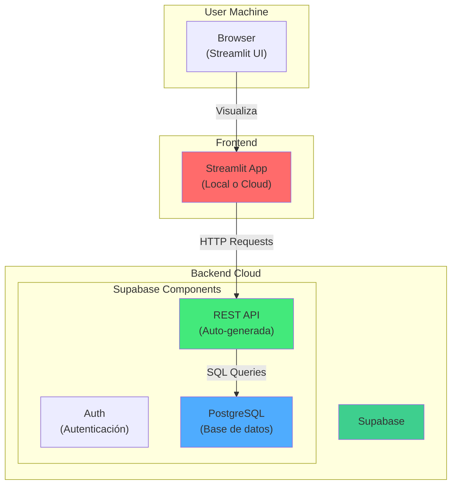
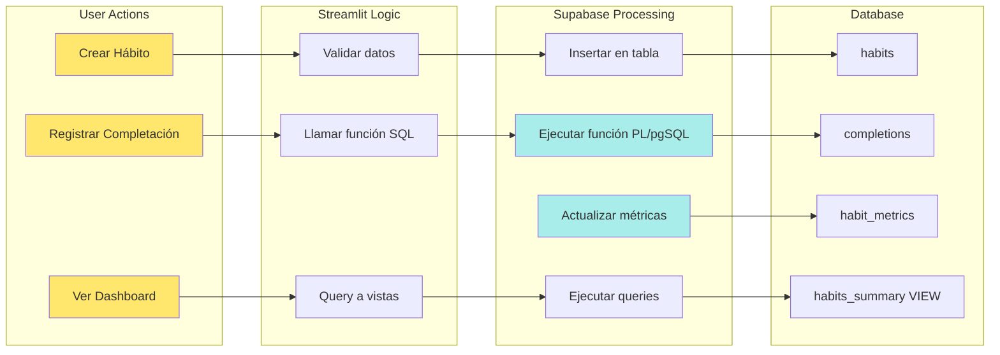
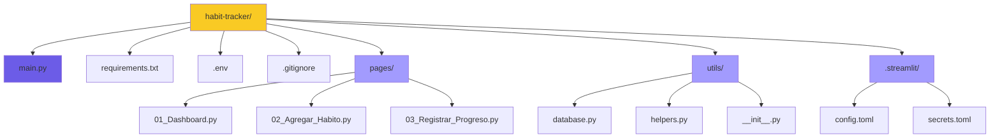
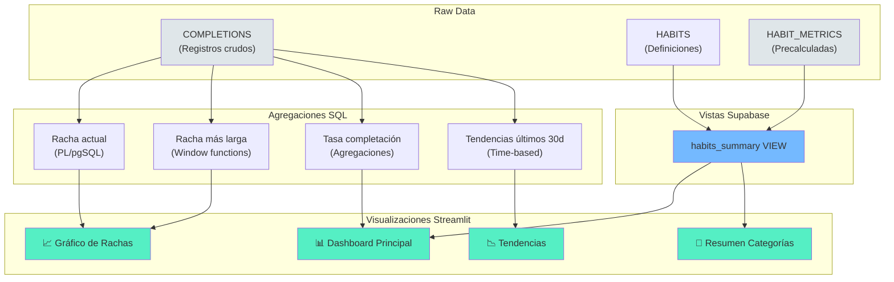
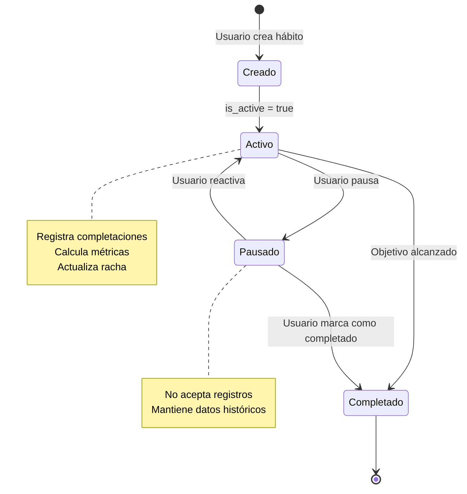
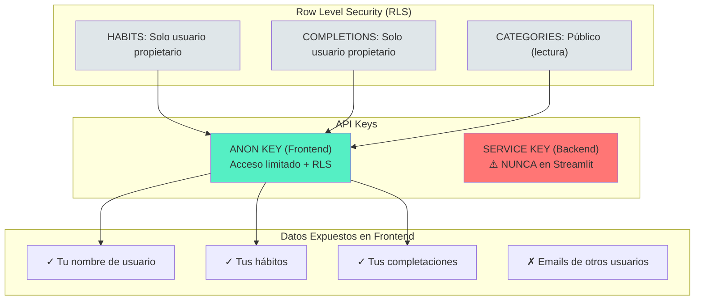
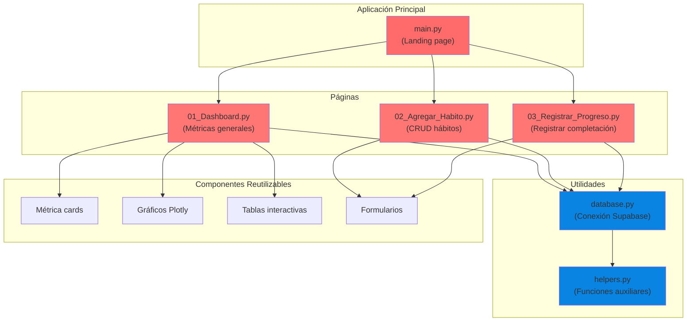

# Diagramas del Proyecto: Habit Tracker

## 1. DIAGRAMA DE ARQUITECTURA GENERAL



---

## 2. DIAGRAMA DE FLUJO DE DATOS



---

## 3. DIAGRAMA DE ENTIDAD-RELACIÓN (ER)

```mermaid
erDiagram
    USERS ||--o{ HABITS : "has"
    CATEGORIES ||--o{ HABITS : "categorizes"
    HABITS ||--o{ COMPLETIONS : "tracked_by"
    HABITS ||--o{ HABIT_METRICS : "has_one"
    HABITS ||--o{ HABIT_CHANGES_LOG : "logs"
    
    USERS {
        uuid id PK
        string email UK
        timestamp created_at
        timestamp updated_at
    }
    
    CATEGORIES {
        int id PK
        string name UK
        text description
        string color
        timestamp created_at
    }
    
    HABITS {
        int id PK
        uuid user_id FK
        string name
        text description
        int category_id FK
        string frequency
        int target_per_week
        int target_per_month
        boolean is_active
        text notes
        timestamp created_at
        timestamp updated_at
    }
    
    COMPLETIONS {
        int id PK
        int habit_id FK
        date completed_date
        timestamp completed_at
        text notes
        int streak_count
        timestamp created_at
    }
    
    HABIT_METRICS {
        int id PK
        int habit_id FK UK
        int current_streak
        int longest_streak
        int total_completions
        decimal completion_rate
        date last_completed_date
        timestamp updated_at
    }
    
    HABIT_CHANGES_LOG {
        int id PK
        int habit_id FK
        string change_type
        jsonb old_values
        jsonb new_values
        timestamp changed_at
    }
```

---

## 4. DIAGRAMA DE ESTRUCTURA DE CARPETAS



---

## 5. FLUJO DE REGISTRO DE COMPLETACIÓN (Detallado)

```mermaid
sequenceDiagram
    participant User as Usuario
    participant ST as Streamlit
    participant DB as Supabase API
    participant SQL as PostgreSQL
    
    User->>ST: Hace clic "Marcar completado"
    ST->>DB: register_completion(habit_id)
    DB->>SQL: RPC: register_completion()
    
    activate SQL
    SQL->>SQL: Insertar en COMPLETIONS
    SQL->>SQL: Calcular calculate_current_streak()
    SQL->>SQL: Actualizar HABIT_METRICS
    SQL-->>DB: ✓ Éxito
    deactivate SQL
    
    DB-->>ST: Response exitosa
    ST->>ST: Refrescar dashboard
    ST-->>User: ✅ "Hábito completado"
    User->>ST: Ve actualizado en tabla
    
    style User fill:#ffe66d
    style ST fill:#ff6b6b
    style DB fill:#43e97b
    style SQL fill:#4facfe
```

---

## 6. DIAGRAMA DE ESTADÍSTICAS Y VISTAS



---

## 7. CICLO DE VIDA DE UN HÁBITO



---

## 8. MATRIZ DE PERMISOS Y SEGURIDAD



---

## 9. COMPONENTES DE STREAMLIT



---

## 10. FLUJO COMPLETO: DE USUARIO A DATOS

```mermaid
graph LR
    A["👤 Usuario<br/>en navegador"] 
    B["🌐 Interfaz<br/>Streamlit"]
    C["📤 HTTP Request<br/>JSON"]
    D["☁️ Supabase<br/>API REST"]
    E["🔐 Validación<br/>RLS + Auth"]
    F["💾 PostgreSQL<br/>Transacción"]
    G["📊 Tabla<br/>Actualizada"]
    H["📥 JSON<br/>Response"]
    I["🎨 Dashboard<br/>Refrescado"]
    
    A -->|Ingresa datos| B
    B -->|Crea payload| C
    C -->|POST/INSERT| D
    D -->|Verifica permisos| E
    E -->|Query SQL| F
    F -->|Commit| G
    G -->|Serializa| H
    H -->|Renderiza| I
    I -->|Visualiza| A
    
    style A fill:#ffe66d
    style B fill:#ff6b6b
    style C fill:#fab1a0
    style D fill:#43e97b
    style E fill:#74b9ff
    style F fill:#4facfe
    style G fill:#a29bfe
    style H fill:#fab1a0
    style I fill:#55efc4
```



---

## RESUMEN VISUAL: Stack Técnico

```
┌─────────────────────────────────────────────┐
│          HABIT TRACKER STACK                │
├─────────────────────────────────────────────┤
│                                             │
│  🖥️  FRONTEND (Streamlit)                   │
│  ├─ Python 3.9+                            │
│  ├─ Streamlit 1.28+                        │
│  └─ Plotly (gráficos)                      │
│                                             │
│  ☁️  BACKEND (Supabase)                     │
│  ├─ PostgreSQL 14+                         │
│  ├─ PostgREST (REST API)                   │
│  ├─ PL/pgSQL (funciones)                   │
│  └─ Row Level Security                     │
│                                             │
│  🔒 AUTENTICACIÓN                           │
│  └─ Supabase Auth (JWT)                    │
│                                             │
│  📦 HOSTING                                 │
│  ├─ Supabase Cloud (BD)                    │
│  └─ Streamlit Cloud (App)                  │
│                                             │
└─────────────────────────────────────────────┘
```
